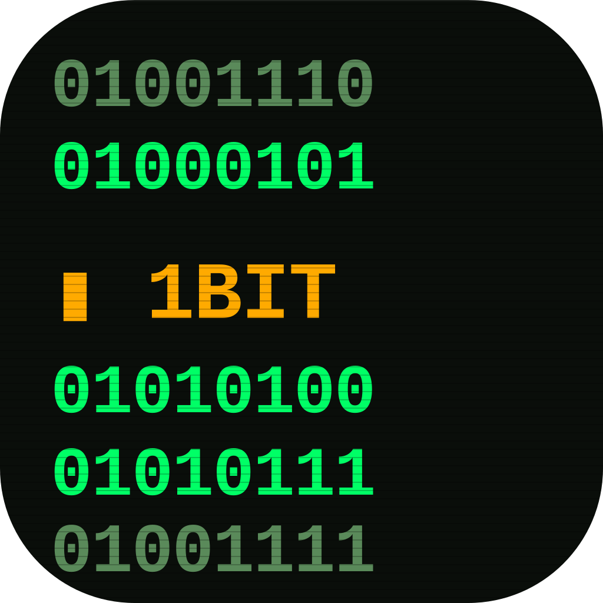

# 1 Bit Data

Native macOS menu bar app + dashboard for tracking network bandwidth — per app, per destination, per network. Terminal-themed, fully local, no telemetry.

**🌐 [1bitstudio.app/data](https://1bitstudio.app/data/)** · **⬇ [Download v0.1.0](https://github.com/feonder/1bit-data/releases/latest)**



## Features

- **Menu bar live readout** — total today, current ↓/↑ speed, mini sparkline
- **Tabbed native dashboard** — overview, apps, destinations, quotas, networks, reports, export, settings
- **Per-app tracking** via macOS `nettop` — including DNS hostname + GeoIP (country, ISP, city)
- **Service grouping** — CDN IPs auto-aggregated under their registrable domain or ISP
- **Network-aware** — auto-detects current Wi-Fi/hotspot via gateway IP, supports friendly aliases
- **HTML reports** — daily / monthly / yearly / last 30 days with charts, drill-down, hourly heatmap
- **Speed test** — built-in `networkQuality` integration with history
- **Quotas + macOS notifications** — daily/weekly/monthly limits per app or network
- **CSV / JSON export** — any period, anytime
- **6 languages** — English (default), Turkish, Spanish, Japanese, Simplified Chinese, Hindi
- **Privacy** — 100% local, no servers, no analytics

## Install

Download from the [**official landing page**](https://1bitstudio.app/data/) or grab the latest `.dmg` directly from [GitHub Releases](https://github.com/feonder/1bit-data/releases/latest). Open the DMG, drag the app to Applications. First launch may ask permission to monitor network — grant it.

The app is signed with a Developer ID and notarized by Apple, so Gatekeeper won't warn.

## Build from Source

```bash
git clone https://github.com/feonder/1bit-data.git
cd 1bit-data
/usr/bin/python3 -m pip install --user rumps psutil pyobjc
/usr/bin/python3 setup.py py2app
open dist/1\ Bit\ Data.app
```

To rebuild the `.icns` from the SVG source:

```bash
/usr/bin/python3 assets/make_icon.py
```

To build the polished DMG (requires Developer ID + notarytool credentials):

```bash
./build_dmg.sh
```

## Architecture

```
data_monitor.py     rumps menu bar daemon (entry point)
dashboard.py        NSWindow main dashboard (8 tabs, terminal-themed)
config_ui.py        Native quota/network editor sheets (PyObjC)
data_tracker.py     nettop sampling + SQLite + DNS/GeoIP enrichment
data_report.py      HTML reports (Chart.js, drill-down)
data_export.py      CSV/JSON export
speedtest.py        networkQuality wrapper
quotas.py           Quota check + notification spam guard
i18n.py             6-language translation table
```

User data lives in `~/.data_monitor*.json` and `~/.data_monitor.db`. Nothing leaves the machine.

## License

MIT — see [LICENSE](LICENSE).

---

Made by [1 Bit Studio](https://1bitstudio.app).
